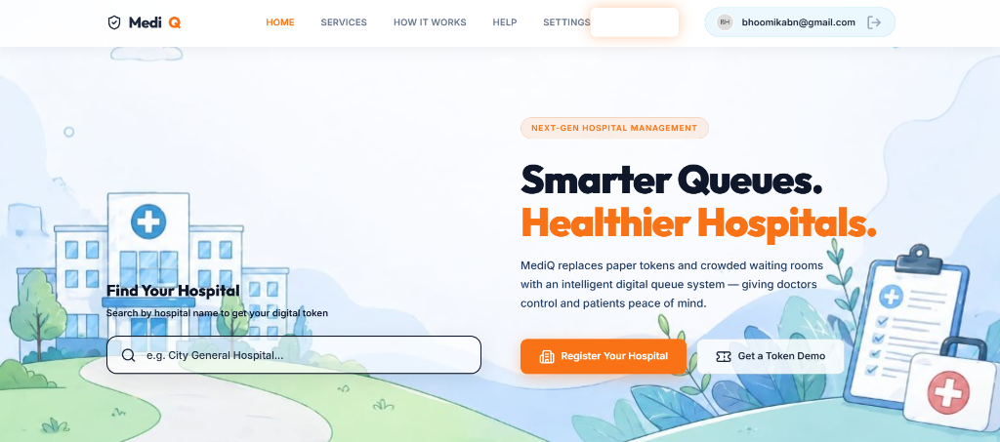
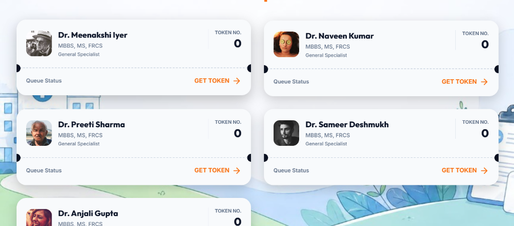
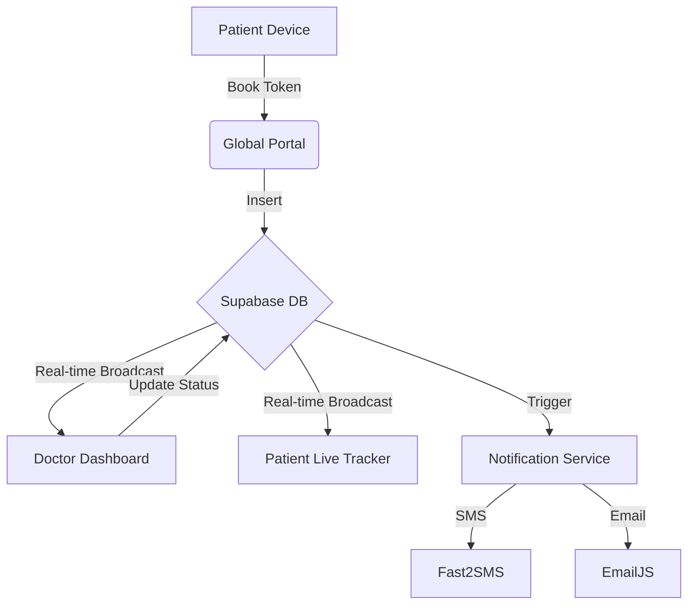

# 🏥 MediQ: Smart Hospital Ecosystem

[](#)
[](#)
[](#)
[](#)

> **MediQ** is a high-performance, real-time hospital queue management system designed to eliminate physical waiting rooms. By leveraging digital token issuance and live tracking, MediQ bridges the gap between medical facilities and patients, ensuring a seamless, dignified healthcare experience.

---

## 📖 Table of Contents
- [✨ Key Features](#-key-features)
- [📸 Screenshots](#-screenshots)
- [🏗️ System Architecture](#-system-architecture)
- [🛠️ Tech Stack](#-tech-stack)
- [🗄️ Database Schema](#-database-schema)
- [🚦 Getting Started](#-getting-started)
- [🔒 Security & RLS](#-security--rls)
- [🚀 Deployment](#-deployment)

---

## 📸 Screenshots

<div align="center">
  
  <p><i>The intuitive patient portal where users can book their tokens and track live queue status.</i></p>
</div>

<br>

<div align="center">
  
  <p><i>The authentication modal with simplified logic for hospital, doctor, and patient access.</i></p>
</div>

---


## ✨ Key Features

### 👤 Patient Experience
*   **Instant Token Issuance**: Book digital tokens via an intuitive portal without physical contact.
*   **Live Queue Tracking**: A dynamic "Live Token" tracker in the global navigation bar providing real-time updates.
*   **Dual Notifications**: Automated SMS (via Fast2SMS) and Email notifications as turns approach.
*   **Self-Service Cancellation**: Empowerment to cancel tokens directly from the tracking modal.

### ⚕️ Clinical Excellence (Doctors)
*   **Centralized Queue View**: High-fidelity dashboard to manage daily patient flow.
*   **One-Touch Interaction**: Call the next patient, skip, or mark as completed with zero latency.
*   **Interactive History**: Comprehensive records of past consultations and patient data.
*   **Profile Control**: Management of specializations, room numbers, and professional bios.

### 🏢 Hospital Administration
*   **Multi-Doctor Onboarding**: Scale your facility by adding unlimited specialists.
*   **Facility Metrics**: Data-driven insights into bed capacity, staff count, and annual patient volume.
*   **Unique Hospital IDs**: `HOSP-XXXXXX` codes for secure joining and identification.

---

## 🏗️ System Architecture



---

## 🛠️ Tech Stack

| Layer | Technology |
| :--- | :--- |
| **Frontend** | Vanilla JS (ES11+), CSS3 (Modern Glassmorphism), HTML5 Semantic markup |
| **Backend** | Supabase (PostgreSQL, Realtime, GoTrue Auth) |
| **Icons & UI** | Lucide Icons, Google Fonts (Outfit & Inter) |
| **Communications** | Fast2SMS API Proxy, EmailJS |

---

## �️ Database Schema

### `hospitals`
Stores medical facility metadata, including location, type, and verification status.
### `profiles`
Extended user profiles for medical staff, linked via `auth.users`. Contains qualifications and cabin assignments.
### `tokens`
The heart of the queue. Managed via status-driven logic (`pending`, `active`, `completed`, `cancelled`).

---

## 🚦 Getting Started

### Prerequisites
- A Supabase account and project.
- Fast2SMS API keys (for SMS features).
- Node.js (only required if using the optional Proxy scripts).

### Installation

1. **Clone the Repository**
   ```bash
   git clone https://github.com/your-username/mediq-hospital-system.git
   ```

2. **Supabase Initialization**
   Run the master SQL script located in the `/sql` folder:
   - **`sql/full_schema.sql`**: Contains the complete definition for all tables, constraints, and Row Level Security (RLS) policies.

3. **Configure Services**
   Create/Update `js/services/supabase.js`:
   ```javascript
   window.supabaseUrl = 'https://your-project.supabase.co';
   window.supabaseKey = 'your-anon-key';
   ```

---

## 🔒 Security & RLS

MediQ utilizes **Row Level Security (RLS)** to ensure data integrity:
- **Hospitals**: Publicly viewable, but only admins can modify facility data.
- **Tokens**: Patients can view all tokens (to see the queue), but can **only update their own** to `cancelled`.
- **Doctors**: Have exclusive permission to update statuses like `active` or `completed` for tokens assigned to them.

---

## � Roadmap / Future Improvements

To evolve from a strong MVP to a full enterprise-grade Healthcare SaaS, the following features are planned:
- [ ] **QR Code Token System**: Patients can scan a physical QR code at the clinic to instantly fetch their ticket, completely bypassing the search process.
- [ ] **AI Queue Prediction**: Machine learning layer to predict precise wait times based on historical doctor consultation durations.
- [ ] **Analytics Dashboard for Admins**: Visual graphs for patient footfall, peak hours, and doctor performance metrics.
- [ ] **Framework Migration**: Transitioning the vanilla frontend structure to Next.js or React for component-based scalability and PWA (Progressive Web App) support.
- [ ] **Payment Integration**: Native consultation fee collection via Razorpay/Stripe during token booking.

---

## �🚀 Deployment

The system is designed to be purely static and can be effortlessly deployed:
- **Vercel / Netlify**: Connect your GitHub and deploy in one click (Highly Recommended).
- **GitHub Pages**: Ensure `index.html` is at the root directory.

*Note: Check `.env.example` for the environment variables setup structure expected in production environments.*

---

### 🛡️ API & Architecture Notes
- The core database logic has been deeply optimized and centralized in `sql/full_schema.sql`.
- We utilize Supabase Realtime Channels to push sub-second queue updates directly to the DOM without heavy polling.
- WhatsApp capabilities proxy via a serverless Edge Function (in `supabase/functions/whatsapp-proxy`) to securely mask vendor API tokens.

---

### 🛡️ Open Source
This project is licensed under the MIT License - see the [LICENSE](LICENSE) file for details.

*Crafting the future of healthcare administration.*
